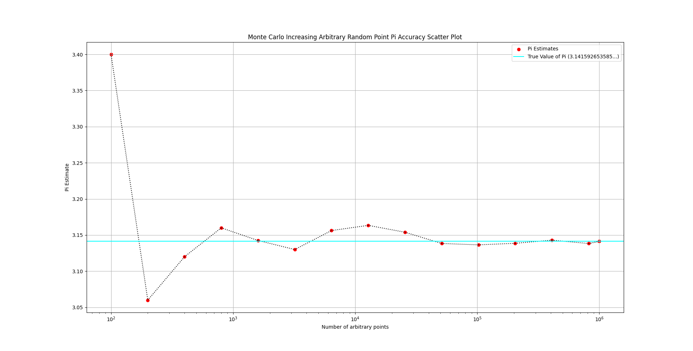

<p align="center">
  
</p>

<h1 align="center">Monte Carlo π Estimator</h1>

<p align="center">
Estimate π using probability, random sampling, and scientific computing.
</p>

<p align="center">


</p>

---

## 📖 Overview

The **Monte Carlo π Estimator** is a Python project that approximates the value of **π (Pi)** using the Monte Carlo Method.

The program generates random points inside a square, determines whether each point lies inside an inscribed unit circle, and estimates π based on the ratio of points inside the circle. It also performs a convergence experiment, demonstrating how the estimate becomes more accurate as the number of random samples increases.

---

## ✨ Features

- 🎯 Monte Carlo π estimation
- 🎲 Random point generation
- 📊 Interactive visualization
- 🔵 Unit circle & square plotting
- 📈 Convergence analysis (100 → 1,000,000 points)
- 📉 Logarithmic accuracy graph
- 🐍 Built with NumPy & Matplotlib

---

## 🧠 The Idea

For a unit circle inside a square of side length **2**,

```
π ≈ 4 × (Points Inside Circle / Total Points)
```

As the number of random samples increases, the estimate converges toward the true value of π.

---

## 📸 Simulation

<p align="center">
  
</p>

The blue points lie inside the unit circle, while the red points lie outside it. Their ratio is used to estimate π.

---

## 📈 Convergence Analysis

<p align="center">
  
</p>

The program automatically performs multiple simulations with increasing sample sizes, illustrating how the Monte Carlo estimate approaches the true value of π.

---

## 🚀 Getting Started

Clone the repository

```bash
git clone https://github.com/rehan-exe/monte-carlo-pi-estimator.git
```

Install the required packages

```bash
pip install numpy matplotlib
```

Run the program

```bash
python MonteCarloPi.py
```

---

## 🔮 Future Improvements

- Interactive GUI
- Animated point generation
- Faster NumPy implementation
- Statistical confidence intervals
- Performance optimizations

---

## 👨‍💻 About Me

Hi! I'm **Rehan Khan**, a student passionate about **Computer Science, Mathematics, Physics, and Scientific Computing**.

I'm currently building projects that combine programming with mathematics and engineering while developing my software engineering portfolio.

---

⭐ If you found this project interesting, consider giving it a star!
