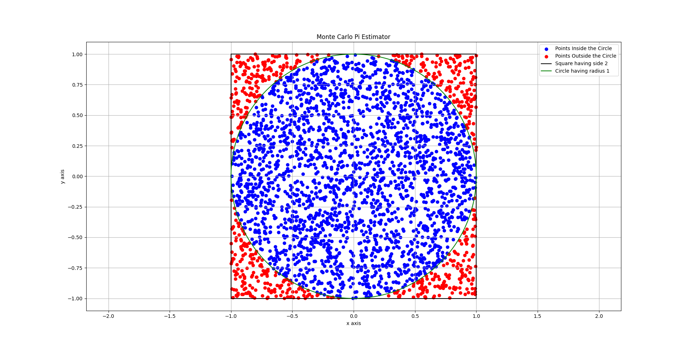

  

<h1 align="center">Monte Carlo π Estimator</h1>

Estimate the value of π using probability, random sampling, and computational mathematics.

---

## 📖 Overview

The **Monte Carlo π Estimator** is a Python project that estimates the mathematical constant **π** using the Monte Carlo Method.

Instead of calculating π through a formula, the program generates thousands (or even millions) of random points inside a square and determines how many fall inside an inscribed unit circle. The ratio of those points is then used to estimate π.
In addition to the simulation, the project includes a convergence experiment showing how the estimate becomes more accurate as the number of random samples increases.
